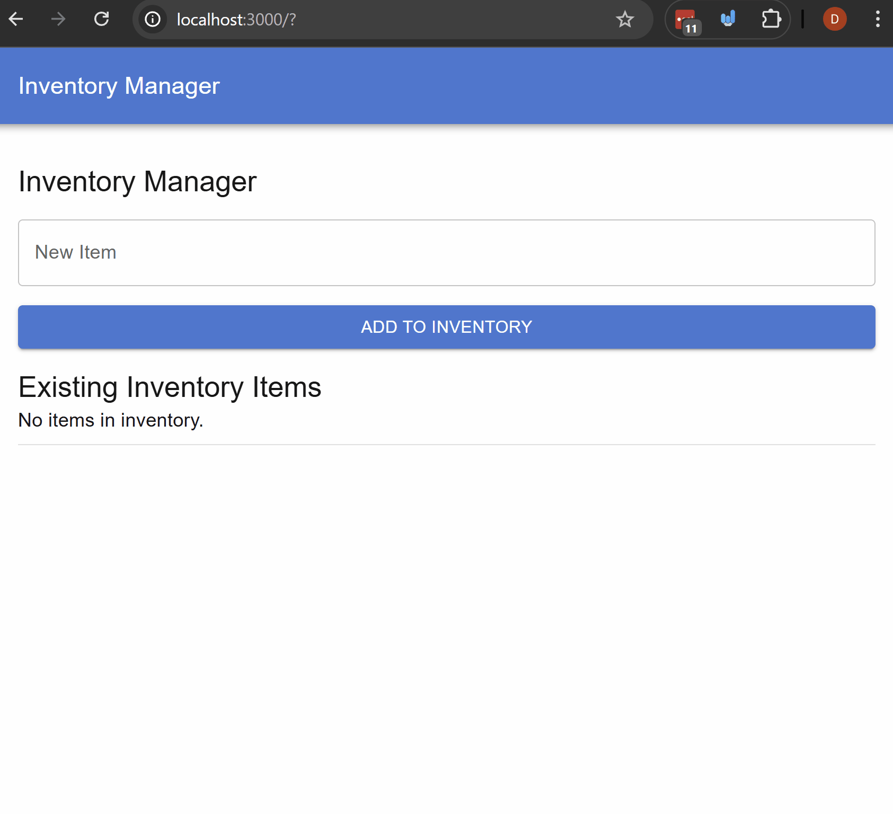
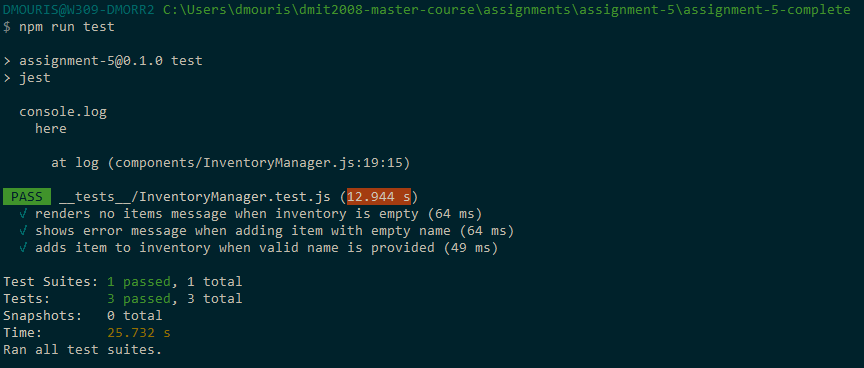

# Assignment 5 - Testing an Application with Jest and React Testing Library

This assignment will test your knowledge of testing React components using Jest and the React Testing Library. You will be required to write unit tests for various components in a Next.js application.

## Steps

### 1. Observe the component `InventoryManager.js` as you'll be testing this.

Here's the existing functionality of the component that you'll have to test.

You'll be using `jest` and `@testing-library/react` to write the tests. These have been installed in the project already but here's the docs for reference:
  - [Jest docs](https://jestjs.io/docs/getting-started)
  - [React Testing Library docs](https://testing-library.com/docs/react-testing-library/intro/)
  - [React testing library jest matchers](https://github.com/testing-library/jest-dom)

You're going to be writing the following tests for the `InventoryManager` component:
  - Test that the component has no items when it is first rendered.
  - Test that when a user tries to add an item with an empty name, an error message is shown.
  - Test that when a user adds an item, the item appears in the list.
### 2. In the `package.json` file, ensure that the test script is set up to run jest tests.
In the json file, in the scripts section ensure that you have the following commands:
   - "test" which should run "jest"
   - "test:watch" which should run "jest --watch"

### 3. In the `__tests__/InventoryManager.test.js` file write the test for the no items case.
1. Create a test called `"renders no items message when inventory is empty"`
2. In your test, Use the `render` method from `@testing-library/react` to render the `InventoryManager` component.
3. use the `getByTestId` method from the render result to get the element with the test id `no-items-message`.
4. Use the `toBeInTheDocument` matcher to assert that the no items message is in the document.

### 4. In the `__tests__/InventoryManager.test.js` file write the test for an empty item name.
1. Create a test called `"shows error message when adding item with empty name"`
2. Select the input field with `getByLabelText` using the label text "Item Name".
3. Select the "Add Item" button with `getByTestId` using the test id `add-item-button`.
4. use `act` function from `@testing-library/react` and inside of the callback click the button.
5. Use `getByTestId` to get the error message element with the test id `error-message`.
6. Use the `toBeInTheDocument` matcher to assert that the error message is in the document.

### 5. In the `__tests__/InventoryManager.test.js` file write the test for adding an item.
1. Create a test called `"adds item to inventory when valid name is provided"`
2. Select the input field with `getByLabelText` using the label text "Item Name"
3. Select the "Add Item" button with `getByTestId` using the test id `add-item-button`.
4. Set the value of the input field to a valid item name using the `fireEvent.change` method.
5. use `act` function from `@testing-library/react` and inside of the callback click the button.
6. Use `getByTestId` to get the item list element with the test id `inventory-items-list`.
7. Use the `toHaveTextContent` matcher to assert that the item list contains the text of the item you added.
8. Check that the

Do this for at least 2 items.

## Expected Output/Functionality
When you run the tests using `npm test` or `npm run test:watch`, all the tests should pass successfully as shown below:

## Bonus

To the original app add a "Remove" button next to each item in the inventory list. When clicked, the item should be removed from the list.

Then, write a test to verify that when the "Remove" button is clicked, the item is removed from the inventory list.

## Marking Key

| Marks | Tasks |
|------------------|------------------|
| 2 | Test script is set up correctly in the `package.json` file |
| 4 | Test for no items when the component is first rendered |
| 4 | Test for error message when adding an item with an empty name |
| 7 | Test for adding items to the inventory when valid names are provided |
| (3) | Bonus: Test for removing an item from the inventory when the "Remove" button is clicked |
| -3 | Project runs without errors, and all tests pass successfully. |
